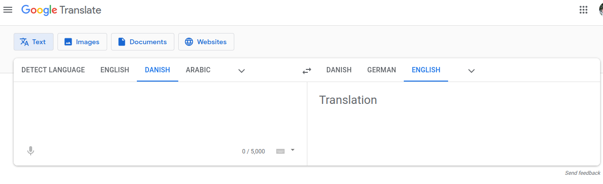

# Røversprogsoversætter (PySide6 + Qt Designer)  
**Kategori:** Programmering  
**Udviklet til Vibenshus Gymnasium**

## 🎯 Introduktion
I denne opgave skal du udvikle en grafisk brugerflade til en **røversprogsoversætter**.  
Brugerfladen udvikles med **Qt Designer**, mens logikken skrives i **Python 3**.  

Vi tager udgangspunkt i *Google Translate*, der ser nogenlunde sådan ud:  



---

## ⚙️ Opsætningskrav
For at komme i gang skal du have følgende installeret:

- **Python 3**
- **PyCharm** eller en anden editor/IDE
- **pyside6** (installeret i et virtuelt miljø)
- **Qt Designer** (følger normalt med, når du installerer pyside6 via `pip`)

---

## 📂 Klargøring af projekt (i PyCharm)

1. Klon opgaven fra GitHub Classroom.  
2. Brug repo’et som dit projekt i PyCharm.  
3. Sørg for, at **PySide6** er installeret (enten i et virtuelt miljø eller globalt).  
4. Skriv dit Python-program i en separat fil, eller brug en af skabelonerne:
   - `roeversprogsoversaetter_direkte_indlaesning.py`  
   - `roeversprogsoversaetter_konvertering_med_uic.py`  

Selve oversættelses-logikken skal ligge i **roeversprog.py**.  

---

## 🧠 Udvikling af logik
Logikken skal holdes adskilt fra brugerfladen, så den kan genbruges i forskellige UI’er.  

### Reglerne for røversprog
1. **Konsonanter** → gentages med et `o` imellem.  
   - Eksempel: `s` → `sos`  
2. **Vokaler** → ændres ikke.  
3. **Udtale** → man staver sig gennem teksten:  
   - `"Røversprog"` → `Ror-ø-vov-e-ror-sos-pop-ror-o-gog`.

### Skabelon (`roeversprog.py`)
```python
# Modul til oversættelse mellem almindeligt sprog og røversprog

def oversaet_til_roeversprog(inputtekst):
    outputtekst = "Denne funktion skal kunne oversætte til røversprog."
    return outputtekst


def oversaet_fra_roeversprog_til_andet_sprog(inputtekst):
    outputtekst = ("Her skal røversproget fjernes og almindeligt sprog skal returneres.\n"
                   "Giv gerne fejlmeddelelser, hvis røversproget ikke er korrekt.")
    return outputtekst
